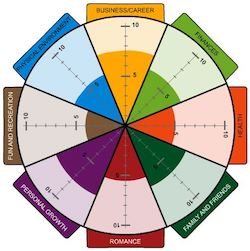

<!DOCTYPE html>
<html>

<head>
    <title>Page Title</title>
    <meta http-equiv="Content-Type" content="text/html; charset=UTF-8">
</head>

<body>

# Well this is a head-line

## This is a bit smaller

### This is even smaller

#### Smallest?

Regular body text.  
With line break.  

New content.  
Again.  
Trigger build for HTML and PDF.  

Two lines without line break
between!  

New line for trigged release.  

Og her er der nogle danske bogstaver: æøå ÆØÅ  

Will this <b>work</b> at all?

An image below here  

</body>

</html>